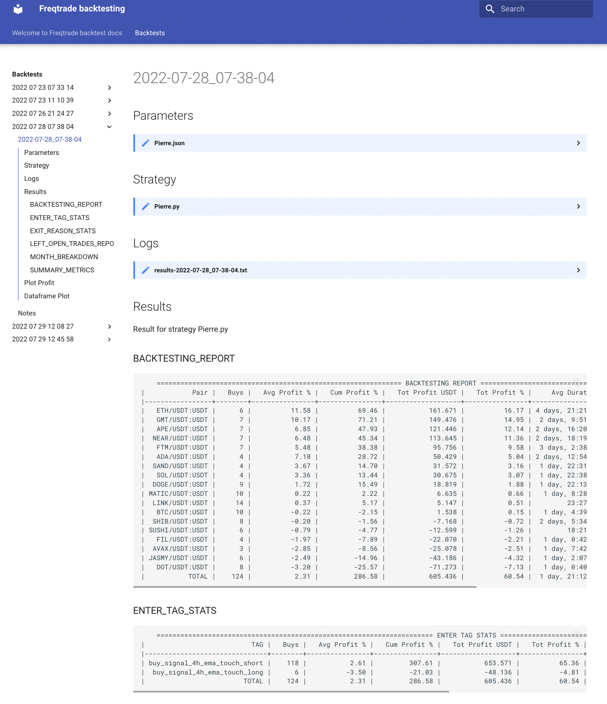

# Welcome to Freqtrade backtest docs

Create docs from your backtests to start refining your freqtrade strategies.

I use the following flow:

- Work on a strategy.
- Run the backtest with `make backtest <parameters here>`.
- Optionally plot-profit and plot-dataframe which renders all the plots with `make plot-profit` and `make plot-dataframe`.
- If you like what you see and want to store the results, including all important artifacts (i.e. strategy, parameters and config file), run `make keep`.
- Generate the docs with `make docs`
- Repeat, improve your strategy, get rich, buy a lambo, retire early

## Headsup

This is just a hobby, not an expert coder, so please check out the code before you run it so you know what's happening. I chose to use `Makefile` to easily run some commands but it has some quirks and certain complexity so I'm open for suggestions.

## Installation

Create a virtualenv and install the required packages (see requirements.txt).

```
python3 -m venv ./.env
pip3 install -r requirements.txt
```
## Run mkdocs

I personally just run `mkdocs serve` so any newly generated docs automatically get served, but you could choose to generate it and serve it from somewhere else.

## Commands

* `make init` - Initializes the mkdocs directories
* `make backtest --config $(config) --strategy $(strategy) --timerange $(timerange) -i $(timeframe)` - Runs the backtest
* `make context` - Generates a context file which stores neccesary information. This step run automatically after running `make backtest`.
* `make plot-profit` - Creates the plot-profit html file
* `make plot-dataframe` - Creates the plot-dataframe html file(s)
* `make keep` - Stores the results of your latest backtest in the `docs/backtests` directory
* `make docs` - Renders the results of your latest backtest into a markdown file

## Mkdocs specific commands
* `mkdocs new [dir-name]` - Create a new project.
* `mkdocs serve` - Start the live-reloading docs server.
* `mkdocs build` - Build the documentation site.
* `mkdocs -h` - Print help message and exit.

## Project layout

    Makefile    # The commands file
    user_data/
        mkdocs/       
            mkdocs.yml              # The configuration file.
            generate_markdown.py    # Generated the markdown files from the latest backtest
            docs/
                index.md            # The documentation homepage.
                backtests/
                    2022-07-08_05-28-47 # Backtest results per directory
            templates/ # Here are the markdown templates stored

## Show me what it looks like



## Overview of all backtest results

`todo`